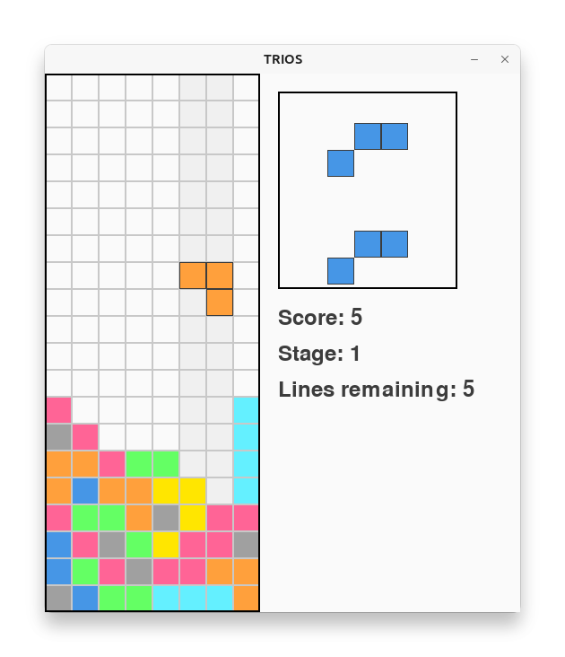

# TRIOS

「テトリス・・・には小さい？」

## 概要

TRIOSは、クラシックなテトリスの公式に独自のアプローチを加えた落ちブロックパズルゲームです。 TRIOSでは、いわゆるテトロミノではなく、三つの接続された四角形から構成されるトリオミノピースが落ちてきます。 この最小限のデザインは最初見た目にすると簡素に感じるかもしれませんが、落ちものとしては新規軸です。 ゲームは8×20のグリッドでプレイされ、シンプルな外観にもかかわらず、コンボ、ステージ、落下速度の加速などの要素があります。

オンラインでも遊べます → https://www.toshihirokamiya.com/trios/

## ルール

**目標:** トリオミノピースを戦略的に回転させて配置し、横1行に隙間なく詰めて（ラインを作って）消して（クリアして）いきます。

**ステージ:** ステージ1で10行をクリアして進み、ステージ2で20行をクリアし、と続きます。

**点数:** クリアした行の数の2乗でスコアが増加し、連続クリア（コンボ）によって倍になります。

**ゲームプレイメカニクス:**

  - ピースはグリッドの上から落ちてきます。左、右または下に動かして回転させ、ラインを完成させる必要があります。
  - サイドには次の2つのピースのプレビューが表示されるので、ラインを作る参考にしてください。
  - ステージを進むにつれて落ちる速度は徐々に増加します。

**ゲームオーバー:** 新しいピースをグリッドに配置できない場合、ゲームは終了します。

## インストール

GitHubから直接TRIOSをpipxでインストールしてください:

```bash
pipx install git+https://github.com/tos-kamiya/trios.git
```

## 実行

インストール後、コマンドラインからスクリプトとしてゲームを実行できます:

```bash
trios
```

## コントロール

- **←**: 現在のピースを左に移動
- **→**: 現在のピースを右に移動
- **↓**: 現在のピースを下に移動
- **↑**: 現在のピースを時計回りに回転
- **スペースバー**: 現在のピースをハードドロップ（即座に底まで落とす）
- **P**: ゲームを一時停止または再開
- **Q** または **Escape**: ゲームを終了

## スクリーンショット



## ライセンス

このプロジェクトはMITライセンスの下で提供されています。詳細は[LICENSE.txt](LICENSE.txt)ファイルを参照してください。

## 謝辞

TRIOSの開発中の**ChatGPT o3-mini-high**からのアシストとガイダンスに感謝します。
