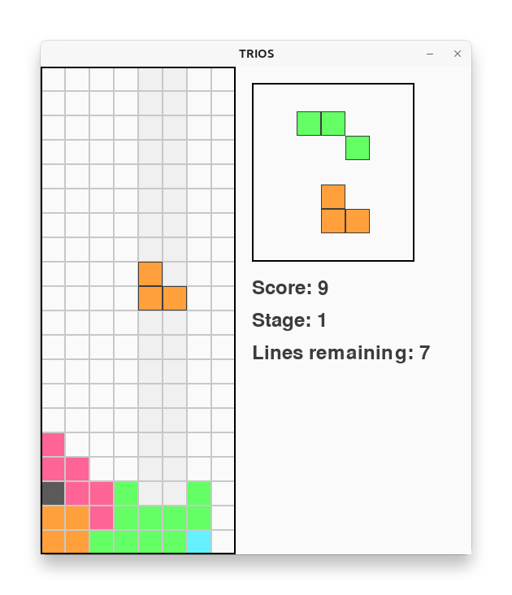

# TRIOS

**"Tetris? ... isn't that a bit too few for that?"**

## Overview

TRIOS is a falling-block puzzle game that puts a unique spin on the classic Tetris formula. Instead of the familiar tetrominoes, TRIOS features triomino pieces -- each composed of three connected squares. This minimalistic design may seem sparse at first glance but offers a fresh and challenging twist on the genre. The game is played on an 8×20 grid, and despite its streamlined appearance, it includes dynamic scoring, stage progression, and an ever-increasing falling speed to keep you on your toes.

You can also play TRIOS online. → https://www.toshihirokamiya.com/trios/

## Rules

**Objective:** Clear horizontal lines by strategically rotating and positioning the triomino pieces.

**Stages:** Clear 10 lines to advance in Stage 1, clear 20 lines in Stage 2, and so on.

**Scoring:** Your score increases based on the square of the number of lines cleared, with a combo multiplier that doubles with consecutive clears.

**Gameplay Mechanics:**

  - Pieces fall from the top of the grid; you must move them left, right, or down, and rotate them to complete lines.
  - A preview of the next two pieces is displayed on the side to help you plan ahead.
  - The falling speed gradually increases as you progress through the stages.

**Game Over:** The game ends if a new piece cannot be placed on the grid.

## Installation

Install TRIOS directly from GitHub using pipx:

```bash
pipx install git+https://github.com/tos-kamiya/trios.git
```

## Execution

After installation, run the game as a script from the command line:

```bash
trios
```

## Controls

- **←**: Move the current piece to the left  
- **→**: Move the current piece to the right  
- **↓**: Move the current piece downward  
- **↑**: Rotate the current piece clockwise  
- **Spacebar**: Hard drop the current piece (instantly drop it to the bottom)  
- **P**: Pause or resume the game  
- **Q** or **Escape**: Quit the game

## Screenshots



## License

This project is licensed under the MIT License. See the [LICENSE.txt](LICENSE.txt) file for details.

## Acknowledgements

Special thanks to **ChatGPT o3-mini-high** for assistance and guidance during the development of TRIOS.
